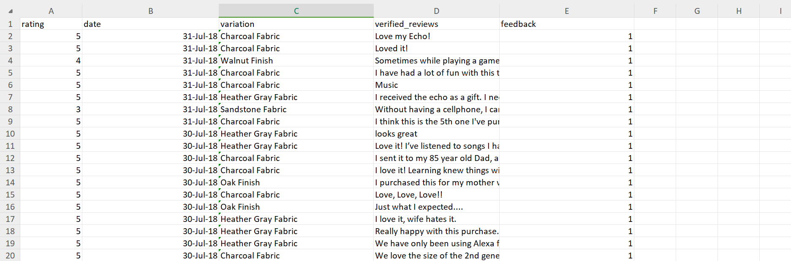

1. Using the for loop, create an R script that will display a 5x5 matrix as shown in Figure 1. It must contain vectorA = [1,2,3,4,5] and a 5 x 5 zero matrix.
```{r}
vectorA <- c(1, 2, 3, 4, 5)

mat <- matrix(nrow = 5, ncol = 5)

for (i in 1:5) {
  for (j in 1:5) {
    mat[i, j] <- vectorA[abs(i - j) + 1]
  }
}

for (i in 1:5) {
  for (j in 1:5) {
    cat(mat[i, j], " ")
  }
  cat("\n")  
}

cat("\n")  

matrixz <- matrix(0, nrow = 5, ncol = 5)


for (i in 1:5) {
  for (j in 1:5) {
    cat(matrixz[i, j], " ")
  }
  cat("\n")  
}
```
2. Print the string "*" using for() function. The output should be the same as shown in Figure
```{r}
for (i in 1:5) {
  for (j in 1:i) {
    cat("*", " ")
  }
  cat("\n")  
}
```
3. Get an input from the user to print the Fibonacci sequence starting from the 1st input up to 500. Use repeat and break statements. Write the R Scripts and its output.
```{r}
inp <- as.integer(readline(prompt = "Input a number: "))
inp <- 0 #example value of input because i cant knit it if it has a value of NA

a <- 0
b <- 1

repeat {
  
  if (a >= inp) {
    cat(a, " ")  
  }
  
  
  fib <- a + b
  a <- b
  b <- fib
  
  if (a > 500) {
    break
  }
}
cat("\n")  

```
4. Import the dataset as shown in Figure 1 you have created previously.
a. What is the R script for importing an excel or a csv file? Display the first 6 rows of the dataset? Show your codes and its result
```{r}
file <- read.table("RespondentsData.csv", header = TRUE, sep = ",")
file

head(file)
```
b. Create a subset for gender(female and male). How many observations are there in Male? How about in Female? Write the R scripts and its output.
```{r}
females <- subset(file, Gender == "F")
males <- subset(file, Gender == "M")
females 
males

#Number of Observations
femalesObs <- nrow(females)
malesObs <- nrow(males)
femalesObs
malesObs
```
c. Create a graph for the number of males and females for Household Data. Use plot(), chart type = barplot. Make sure to place title, legends, and colors. Write the R scripts and its result.
```{r}
load("householdData.RData")

#i searched and used this function because the orginal householdData dataframe has extra spaces and it created an extra bar for male category. 
householdData[["Sex"]] <- gsub(" ", "", householdData[["Sex"]])

#i also searched the table function to easily count the frequency of each gender. This is where i encountered the duplicate bar for male category when i first created the bar plot. It happened because there are extra spaces on my householdData dataframe where some looked like this " male".
genderCounts <- table(householdData$Sex)
barplot(
  genderCounts,
  col = c("pink", "blue"),
  main = "Number of Males and Females in Household",
  xlab = "Gender",
  ylab = "Count"
)
```
5. The monthly income of Dela Cruz family was spent on the following:
a. Create a piechart that will include labels in percentage.Add some colors and title of the chart. Write the R scripts and show its output.
```{r}
amounts <- c(60, 10, 5, 25)
categories <- c("Food", "Electricity", "Savings", "Miscellaneous")
labels <- paste(categories, amounts, "%")

pie(
  amounts,
  labels = labels,
  col = c("yellow", "green", "pink", "orange"),
  main = "Expenses of Dela Cruz Family"
)
```
6. Use the iris dataset.
a. Check for the structure of the dataset using the str() function. Describe what you have seen in the output.
```{r}
data(iris)
str(iris)
```
The iris data is a dataframe and based on the str function, it has 150 observations/rows and 5 variables/columns. The variables are Sepal.Length, Sepal.Width, Petal.Length, Petal.Width, and Species.

b. Create an R object that will contain the mean of the sepal.length,
sepal.width,petal.length,and petal.width. What is the R script and its result?
```{r}
means <- c(
  Sepal.Length = mean(iris$Sepal.Length),
  Sepal.Width = mean(iris$Sepal.Width),
  Petal.Length = mean(iris$Petal.Length),
  Petal.Width = mean(iris$Petal.Width)
)
means
```
c. Create a pie chart for the Species distribution. Add title, legends, and colors. Write the R script and its result.
```{r}
species <- table(iris$Species)
colors <- c("blue", "green", "pink")

pie(
  species,
  main = "Species Distribution",
  col = colors,
  labels = paste(names(species), "\n", species),
)

legend(
  "bottomleft",
  legend = names(species),
  fill = colors,
  title = "Species"
)
```
d. Subset the species into setosa, versicolor, and virginica. Write the R scripts and show the last six (6) rows of each species.
```{r}
setosa <- subset(iris, Species == "setosa")
versicolor <- subset(iris, Species == "versicolor")
virginica <- subset(iris, Species == "virginica")

tail(setosa)
tail(versicolor)
tail(virginica)
```
e. Create a scatterplot of the sepal.length and sepal.width using the different species(setosa,versicolor,virginica). Add a title = “Iris Dataset”, subtitle = “Sepal width and length, labels for the x and y axis, the pch symbol and colors should be based on the species.
```{r}
iris$Species <- as.factor(iris$Species)

colors <- c("setosa" = "blue", "versicolor" = "green", "virginica" = "pink")
symbols <- c("setosa" = 16, "versicolor" = 17, "virginica" = 18)

plot(
  iris$Sepal.Length, iris$Sepal.Width,
  col = colors[iris$Species],
  pch = symbols[iris$Species],
  main = "Iris Dataset",
  sub = "Sepal width and length",
  xlab = "Sepal Length",
  ylab = "Sepal Width"
)

legend(
  "topleft",
  legend = levels(iris$Species),
  col = colors,
  pch = symbols,
  title = "Species"
)
```
f. Interpret the result.
The scatterplot shows the relationship between Sepal Length and Sepal Width for the three species. Setosa has the widest sepal but also has the shortest sepal length among the species. Versicolor on the other hand has average sepal width and longer sepal. Lastly, the Virginica has the longest sepal and an average sepal width.

7. Import the alexa-file.xlsx. Check on the variations. Notice that there are extra whitespaces among black variants (Black Dot, Black Plus, Black Show, Black Spot). Also on the white variants (White Dot, White Plus, White Show, White
Spot).
```{r}
library(readxl)
alexa <- read_xlsx("alexa_file.xlsx")
alexa
```
a. Rename the white and black variants by using gsub() function.
```{r}
alexa$variation <- gsub("Black  Dot", "BlackDot", alexa$variation)
alexa$variation <- gsub("Black  Plus", "BlackPlus", alexa$variation)
alexa$variation <- gsub("Black  Show", "BlackShow", alexa$variation)
alexa$variation <- gsub("Black  Spot", "BlackSpot", alexa$variation)
alexa$variation <- gsub("White  Spot", "WhiteSpot", alexa$variation)
alexa$variation <- gsub("White  Show", "WhiteShow", alexa$variation)
alexa$variation <- gsub("White  Plus", "WhitePlus", alexa$variation)
alexa$variation <- gsub("White  Dot", "WhiteDot", alexa$variation)

alexa$variation[1052:2000]


```
b. Get the total number of each variations and save it into another object. Save the object as variations.RData. Write the R scripts. What is its result?
```{r}
library(dplyr)
totalVar <- alexa %>%
count(alexa$variation)
totalVar

save(totalVar, file = "variations.RData")
```
c. From the variations.RData, create a barplot(). Complete the details of the chart which include the title, color, labels of each bar.
```{r}
load("variations.RData")

barplot(
  totalVar$n,
  col = c("pink", "blue", "skyblue", "lightgreen"),
  main = "Total Number Of Each Variations",
  ylab = "Variants",
  names.arg = totalVar$`alexa$variation`,         
  las = 2      
)
```
d. Create a barplot() for the black and white variations. Plot it in 1 frame, side by side. Complete the details of the chart.
```{r}
library(dplyr)

load("variations.RData")

par(mfrow = c(1, 2))

blackV <- totalVar %>% 
  filter(`alexa$variation` %in% c("Black", "BlackDot", "BlackPlus", "BlackShow", "BlackSpot"))

barplot(
  height = blackV$n, 
  names.arg = blackV$`alexa$variation`, 
  col = c("pink", "blue", "skyblue", "lightgreen", "cyan"),               
  main = "Black Variants",
  xlab = "Total Numbers",                         
  ylab = "Variations",
  las = 2
)

WhiteV <- totalVar %>% 
  filter(`alexa$variation` %in% c("White", "WhiteDot", "WhitePlus", "WhiteShow", "WhiteSpot"))

barplot(
  height = WhiteV$n,  
  names.arg = WhiteV$`alexa$variation`, 
  col = c("pink", "blue", "skyblue", "lightgreen", "cyan"),               
  main = "White Variants",
  xlab = "Total Numbers",                         
  ylab = "Variations",
  las = 2
)
```


